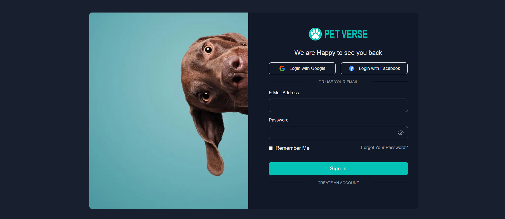
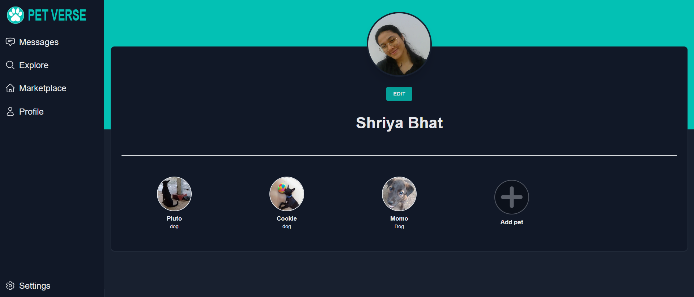
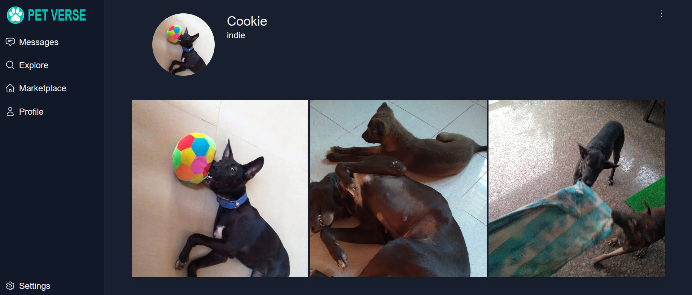
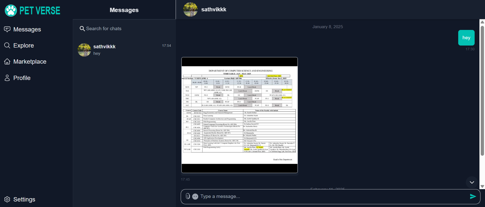

# 🐾 PetVerse - Buy, Sell & Socialize for Pets

**PetVerse** is a web application that allows users to buy, sell, and create social profiles for pets. It provides a seamless platform for pet lovers to explore pet listings, engage in chat, and maintain pet accounts.

## Features

- **Buy & Sell Pets**: List pets for sale and explore available pets.
- **Pet Accounts**: Create pet social profiles inside the User profiles.
- **Marketplace**: Buy pet-related products and accessories from fellow users.
- **Messaging**: Chat with buyers, sellers, and pet enthusiasts.
- **Authentication**: Secure login and signup.

## Project Structure

## 🛠 Tech Stack

- **Frontend**: React.js, Next.js, Tailwind CSS
- **Backend**: Node.js, Express.js
- **Database**: MongoDB (Firebase for authentication)
- **Storage**: Firebase Storage (for images)
- **Deployment**: Vercel

##  Deployed Application

🔗 **Live Demo**: [PetVerse - Buy & Sell Pets](https://petverse-shriya-20-shriya-bhats-projects.vercel.app)

